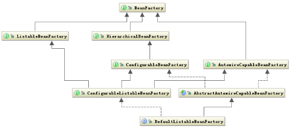

# Spring源代码和原理分析

assembled by hellmonky 
start at 2016年11月23日15:01:42


## 一 基本概念和准备
在开始源代码学习的过程中，需要有一些基本的环境支持来帮助我们方便的进行源代码的阅读；并且还需要有一些针对要阅读源代码的领域知识来帮助自己梳理整体思路。
在上述两者的综合作用下，才能有的放矢的去进行源代码的阅读和分析，帮助自己更为深刻的理解包含在源代码中的设计思想。

### 1 关于源代码阅读
一个开源框架在学习的过程中，最重要的就是理解了原理然后使用，在理解原理和使用的过程中能够方便的查看源代码是非常重要的。
以往主要有以下三种方式阅读规模庞大的源代码：
> 1.本地软件完成对源代码的索引和阅读，例如sourceInsight；
> 2.通过互联网上提供的网站来进行代码索引和阅读；
> 3.搭建编译环境，将需要阅读的代码实际进行编译，然后在IDE中进行代码的索引和阅读；

上述三种方法，都有各自的明显的特点：
> 1.第一种因为本地软件的匮乏和功能的不完善，并不能完整的覆盖需要阅读源代码的种类和范围，并且软件往往收费，个人用户使用成本高；
> 2.第二种需要别人搭建好的网站提供服务，只能查询当前是否有人支持；
> 3.第三种需要的资源很多，搭建过程比较复杂，但是搭建后可以修改代码进行编译，通过编译器调试可以方便动态理解整个源代码的流程。

综上所述，第一种方式已经趋向于淘汰；第二种方式虽然方便阅读，但是需要有对应的网络提供商支持，除了最热门的代码，小众代码并没有支持；第三种方式在需要实际编译的时候更为合适，如果只是简单阅读，成本太高。

如果有结合1和2这两个方面：支持自己导入源代码，使用网页浏览。这样的源代码阅读软件，对于非编译型需求来说已经非常足够了。
现在还有一个开源项目[OpenGrok](https://github.com/OpenGrok/OpenGrok)，就是通过搭建一个web服务来完成对用户导入的源代码的索引和浏览，完美贴合上述要求。

现在以本文着力需要分析的[spring-framework](https://github.com/spring-projects/spring-framework)为例，就来尝试搭建网页端源代码浏览和编译环境浏览这两种方式。

#### 1.1 使用OpenGrok搭建spring-framework源代码阅读环境：
根据[OpenGrok的官方指导教程](https://github.com/OpenGrok/OpenGrok/blob/master/README.txt)可知，如果不编译OpenGrok本身，只是通过release的可执行文件来搭建源代码阅读环境，只需要一下系统组件：
>Latest Java (At least 1.8)
>A servlet container like Tomcat (8.x or later)
>Exuberant Ctags or Universal Ctags
>Source Code Management installation

我已经安装好了：jdk1.8.0_102，apache-tomcat-8.5.8，ctag（已经添加到了系统环境变量中）和git for windows。

然后就可以进行如下步骤：

##### （1）下载OpenGrok最新release版本：
从[官方release](https://github.com/OpenGrok/OpenGrok/releases)下载最新的tar.gz包到本地，到目前为止，最新为opengrok-0.13-rc4.tar.gz；
将opengrok-0.13-rc4.tar.gz解压到指定路径，我这儿将解压缩到：
```shell
E:\0-bin\opengrok-0.13-rc4
```
文件夹下，然后将../opengrok-0.13-rc4/lib/source.war解压缩到apache-tomcat-8.5.8的webapp目录下。

##### （2）编辑source.war的web.xml配置文件：
使用编辑器打开../webapps/source.war/WEB-INF/web.xml，然后修改其中的配置项：
```shell
<context-param>
    <description>Full path to the configuration file where OpenGrok can read its configuration</description>
    <param-name>CONFIGURATION</param-name>
    <param-value>E:\0-bin\opengrok-0.13-rc4\data\configuration.xml</param-value>
</context-param>
```
保存后推出，将CONFIGURATION这个key的值设置为将要生成配置文件的路径，OpenGrok将会在这个路径下会生成configuration.xml文件。

##### （3）在OpenGrok解压缩目录下创建文件夹：
我们需要在OpenGrok的解压缩目录下创建文件夹来存放OpenGrok运行时需要的数据，创建data和source两个文件夹，这个时候的目录结构为：
```shell
-----
    |-bin
    |-data
    |-doc
    |-lib
    |-Management
    |-source
```

##### （4）在source文件夹下导入源代码：
接下来就需要在上述创建的source文件夹下导入需要阅读的源代码包了，这个使用git获取最新的Spring-framework源代码包：
```shell
git clone https://github.com/spring-projects/spring-framework.git
```
也可以将下载的源代码压缩包解压到这个文件夹下。
这儿有一个好处，在阅读linux代码的时候，由于windows不支持过多的目录层级导致linux源代码包无法在windows下正常解压，所以使用linux下的tomcat可以完美解决这个问题。

##### （5）创建源代码的索引：
在启动OpenGrok之前，需要使用ctag对当前导入在source文件夹下的源代码建立索引，并且将配置文件写入到data文件夹下，需要执行如下命令：
```shell
java -Xmx524m -jar opengrok.jar -W "E:\\0-bin\\opengrok-0.13-rc4\\data\\configuration.xml" -P -S -v -s "E:\\0-bin\\opengrok-0.13-rc4\\source" -d "E:\\0-bin\\opengrok-0.13-rc4\\data"
```

##### （6）启动OpenGrok：
启动tomcat服务器，就可以在网页中输入：
```shell
http://localhost:8080/source
```
来访问了。


参考文档：
[如何把 opengrok 安装在 windows上](http://blog.csdn.net/mickeyfirst/article/details/9044337)

#### 1.2 使用IDEA搭建spring-framework源代码阅读环境：
spring-framework官方默认使用eclipse来进行开发，并且提供了导入到eclipse的脚本来简化导入过程。但是现在也提供了导入到IDEA中进行源代码编译的文档，虽然没有eclipse那么方便，但是还是可以导入进行编译。
本节将参考[官方文档](https://github.com/spring-projects/spring-framework/blob/master/import-into-idea.md)完成对Spring-framework在IDEA中的导入和编译。

参考文档：
> - 1. [intellij idea搭建spring源码阅读环境](http://blog.csdn.net/sw277378347/article/details/44978493)


### 2 Spring的核心：
要理解Spring的核心，首先需要明确Spring被设计之初的定位是什么，然后通过这个定位来分析要实现它所需要依赖的基本技术，这些基本技术就是整个Spring的核心技术。

#### 2.1 Spring的设计理念：
Spring handles the infrastructure so you can focus on your application.
Spring目的：让对象与对象（模块与模块）之间的关系不通过代码来关联，而是通过配置类说明管理的（Spring根据这些配置 内部通过反射去动态的组装对象）。
通过将对象之间的依赖关系通过配置文件表达和管理，也就是所谓的依赖注入机制，Spring框架为开发人员提供了便利性，让开发人员专注于业务逻辑的实现。

整个java程序的运行可以看作是：构建一个数据结构，然后根据这个数据结构设计他的生存环境，并让它在这个环境中按照一定的规律在不停的运动，在它们的不停运动中设计一系列与环境或者与其他个体完成信息交换。
Spring在这个过程中能够帮助我们完成个体之间的信息交换，我们只需要负责设计个体各自的运动轨迹就可以了。

Spring是一个容器，凡是在容器里的对象才会有Spring所提供的这些服务和功能。

#### 2.2 Spring的核心技术：
Spring就是面向java Bean的编程（BOP,Bean Oriented Programming），Bean在Spring中才是真正的主角。然后Spring从这个角度从下到上组织了如下三个核心技术模块：
> - 1. Bean之间的依赖关系通过配置文件进行描述，这些配置文件描述了Bean之间的注入关系，然后被Spring用IoC来管理这些注入关系；
> - 2. 为了方便Bean之间交互，还需要一些基本工具支持，Spring提供了Core组件，这个组件负责完成：发现、建立和维护每个Bean之间的关系所需要的一些列的工具，例如提供了统一的资源访问形式；
> - 3. 围绕Bean之间的交互活动，还需要Bean的运行上下文来提供运行场景和记录轨迹，Spring的Context组件就是包裹了Bean和Core的IoC容器，包含着Bean之间的相互关系。

根据上述三个基本层次化的组件就搭建了整个Spring的骨骼，其他Spring组件和框架都是建立在这三个组件的基础上的。

##### 2.2.1 Bean组件：
Bean组件实现了将对象通过配置文件的方式，由Spring来管理对象存储空间，生命周期的分配。通过依赖注入的方式，可以实现将对象注入到指定的业务逻辑类中。这些注入关系，由Ioc容器来管理。
因此，Spring的核心思想常常被称作BOP(Bean Oriented Programming)，面向Bean编程。
Bean组件定义在Spring的org.springframework.beans包下，解决了以下几个问题：
> 1. Bean的定义
> 2. Bean的创建
> 3. Bean的解析

使用者只需要关注Bean的创建，其他两个过程由Spring内部完成，对用户来说是透明的。

Spring Bean的整体架构是典型的工厂模式，顶层的接口是BeanFactory，定义在：../spring-framework/spring-beans/src/main/java/org/springframework/beans/factory/BeanFactory.java 这个文件中。
具体的继承细节为：


ListableBeanFactory、HierarchicalBeanFactory和AutowireCapableBean是其三个直接子类，目的是为了区分Spring内部对象处理和转化的数据限制。
> 1. ListableBeanFactory: 表示这些Bean是可列表的
> 2. HierarchicalBeanFactory: 表示这些Bean有继承关系
> 3. AutowireCapableBeanFactory: 定义Bean的自动装配规则

这几个接口分别定义了Bean的集合、Bean的关系和Bean的行为。

###### <1> Bean的定义：
Bean的定义类层次核心是RootBeanDefinition，在源码的位置是：../spring-framework/spring-beans/src/main/java/org/springframework/beans/factory/support/RootBeanDefinition.java
Spring的配置文件中定义的<bean/>节点，成功解析后都会被转化为BeanDefinition对象，之后所有的操作都会在BeanDefinition对象之上进行。


###### <2> Bean的解析：
Bean解析的主要任务是：对Spring的配置文件进行解析，最后生成BeanDefinition对象。解析过程非常复杂，包括配置文件里所有的tag。


##### 2.2.2 Context组件：
Bean包装的是一个个Object，Object中存储着业务所需的数据。所以，如何给这些数据及之间的关系提供生存、运行环境（即保存对象的状态），就是Context要解决的问题。Context实际上就是Bean关系的集合，又称之为Ioc容器。
ApplicationContext是Context最上层的接口。

ApplicationContext能够标识一个应用环境的基本信息。其上继承了5个接口，用于拓展Context的功能，其中BeanFactory用于创建Bean，同时继承了ResourceLoader接口，用于访问任何外部资源。


##### 2.2.3 Core组件：


参考文档：
[](https://segmentfault.com/a/1190000007356573)


#### 2.3 Spring实现依赖的java技术要素：
上述Spring设计理念中描述的内容，并不局限于java语言，那么为什么Spring是一个java框架，而不是一个C++或者Python框架？
所以Spring的理念的实现也是需要一些语言特性支持的，我们来分析下要完成上述理念，一门包含哪些特性的语言可以实现一个Spring框架，以及是否真的有对应的框架已经被实现了。

**使用java实现的Spring-framework最基本的需求就是IoC，而IoC依赖于DI（Dependency Injection），而DI又需要GC的（Garbage Collection）支持。**
要理解这点，我们从头进行梳理。

##### 2.3.1 Spring最基本的对Bean的管理：
Spring-framework在管理Bean的时候，使用配置文件也好，使用注解也好，都是将这个Bean的创建方法（也就是Bean的定义的class文件）进行了记录，然后Spring-framework能够通过在需要的时候找到这个Bean的时候然后创建出这个Bean来。
这儿就使用了java的反射来完成运行时的Bean的动态创建：通过Spring中的配置文件或者注解，找到这个Bean对应的class文件，然后动态生成Bean的实例，然后调用对象中的方法。

##### 2.3.2 Spring的DI：
Spring-framework还通过配置文件或者注解，记录了Bean之间的相互依赖关系（注入关系），然后通过这个关系描述，将运行时动态生成的


http://stackoverflow.com/questions/352885/dependency-injection-in-c


#### 2.4 Spring能被用来干什么：
详细的了解了Spring的设计理念和核心技术，从技术的角度出发来看看Spring能够干什么，是非常有利于理解现在Spring正在干什么的。


### 3 Spring的三个基础组件分析：


### 4 关于建立在Spring框架上的java生态环境：


使用持续集成方式将当前整个项目环境进行搭建：
参考文档：
[centos＋Jenkins＋maven＋nginx，完整搭建持续集成小结](https://testerhome.com/topics/4043)

使用jekins调用docker来管理服务：[持续集成环境的搭建（基于 Jenkins、Docker、Git）](http://yyqian.com/post/1460773574738/)

使用环境隔离来完成基本的持续集成方案，将当前的程序设计流程更为合理化的处理，使用自动脚本来减少人为的部署工作量，集中精力于软件设计上。

对于本地系统的监控：
[用python 10min手写一个简易的实时内存监控系统](https://github.com/shengxinjing/my_blog/issues/1)


关于SpringBoot中静态资源的访问：
和传统的war包不同，现在使用的


Spring中最核心的理念就是提供服务，最典型的就是通过IoC来提供对基本java对象的管理，然后在这个基础上完成一些列的后续服务支持。
IoC就是Inversion of Control，将用户自己创建所需要对象的过程，通过服务帮助自动完成，不用关心具体的构造过程。
关键概念：
被注入对象：就是当前需要调用其它类完成功能的类；
被依赖对象：就是被调用的类。
正常状态下被注入的对象会直接依赖于被依赖的对象，需要我们主动获取被依赖的对象；IoC帮助我们管理被依赖的对象，然后帮我们自动注入到被注入的对象中去。

我们只需要在用到依赖对象的时候，他能够准备好就够了，完全不用考虑是自己准备的还是别人送过来。
Spring虽然发展了很多年，但是其内核结构并没有发生重大变化，所以从Spring的实现的基础原理来理解整个Spring


重要更改：
（1）SaaS改为SOA，这两者之间的理念还是不同的，并且现在强调开发为微服务架构，有一个概念上的清晰理解；
（2）强调对Spring和SpringBoot之间的演进关系的表述，根据项目时间来进行安排；
这个可以参考：[为什么做java的web开发我们会使用struts2，springMVC和spring这样的框架?](http://www.cnblogs.com/sharpxiajun/p/3936268.html)
（3）对于大数据方面的描述不够多，并且不确切，需要一个完整的思路展现；


